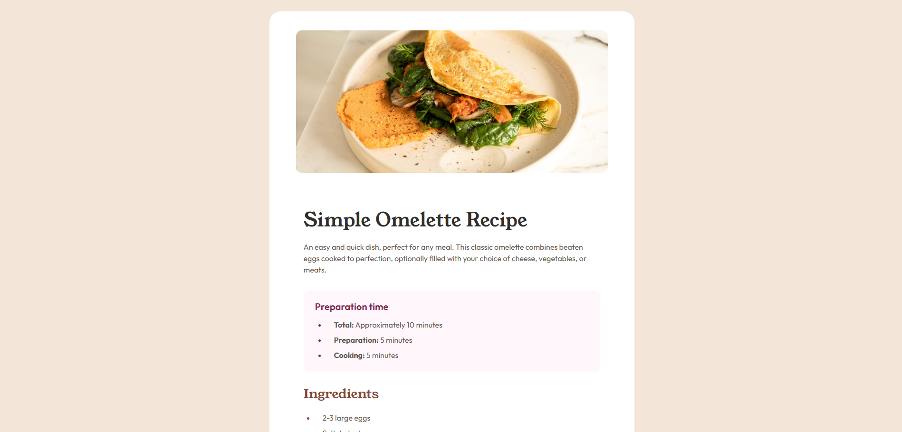

# Frontend Mentor - Recipe page solution

This is a solution to the [Recipe page challenge on Frontend Mentor](https://www.frontendmentor.io/challenges/recipe-page-KiTsR8QQKm). Frontend Mentor challenges help you improve your coding skills by building realistic projects.

## Table of contents

- [Overview](#overview)
    - [Screenshot](#screenshot)
    - [Links](#links)
    - [Built with](#built-with)
    - [What I learned](#what-i-learned)
    - [Author](#author)

## Overview

### Screenshot

### Links

- Solution URL: (https://github.com/hallgatolaszlo/Recipe-Page)
- Live Site URL: (https://hallgatolaszlo.github.io/Recipe-Page/)

### Built with

- Semantic HTML5 markup
- CSS custom properties
- Flexbox

### What I learned

List and table styling

### Author

- Frontend Mentor - [@yourusername](https://www.frontendmentor.io/profile/hallgatolaszlo)
